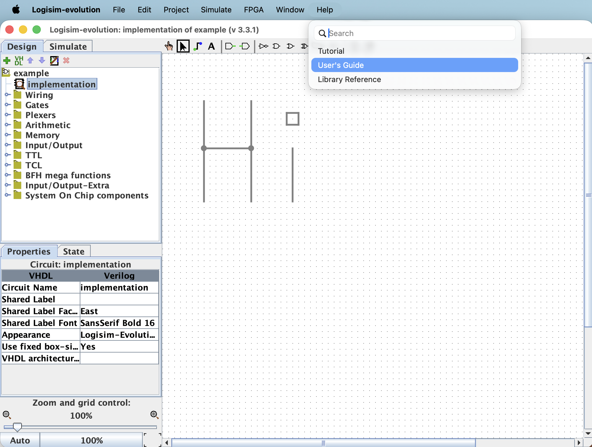
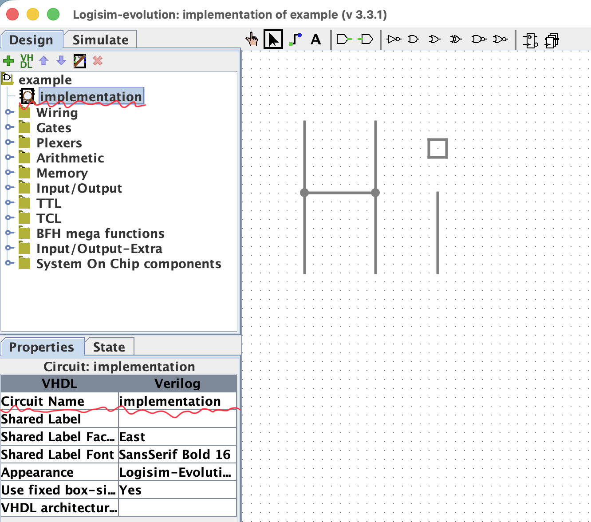

# Assignment 1: Digital Logic Gates in Logisim

In this assignment, you will build fundamental digital logic gates using Logisim Evolution. You'll start by creating a NAND gate from basic transistors, then use NAND gates to implement other logic gates. This exercise demonstrates how all digital logic can be built from simple components.

## Getting Started with Logisim

### Installation and Setup
Download and install Logisim Evolution from [here](https://canvas.ucdavis.edu/courses/1007534/files/28624125?wrap=1) (canvas link). \
If you're not familiar with Logisim Evolution, please read the user guide first: logisim navbar > Help > User's Guide.

### Circuit Naming Convention
**Important:** All your circuits must be named "implementation" for the autograder to work properly.

**Note:** You don't need to label inputs and outputs (they don't matter). But you should have the correct number of inputs and outputs.

## Submission Instructions

- Submit each problem as a **separate** `.circ` file
- Filenames can be anything you want (e.g., `nand_gate.circ`, `and_gate.circ`, etc.)
- Make sure each circuit is named "implementation" inside Logisim
<!-- - Test your circuits using the provided test vector files before submission -->

---

## Assignment Tasks

### Task 1: Build a NAND Gate 🔧

**Requirements:**
- Use **only** components from the "Wiring" folder in Logisim
- You can build a NAND gate using just Pull Resistors and Transistors
- Name your file `nand.circ`

**Hint:** Think about how transistors work as switches and how to combine them to create NAND logic.

<!-- **Testing:** Use the provided test vector file to verify your NAND gate works correctly. -->

---

### Task 2: Build an AND Gate

**Requirements:**
- from now on, you can use NAND gate provided in `Gates` folder. 
- Use **only** NAND gates (no other logic gates)
- Name your file `and.circ`

---

### Task 3: Build an OR Gate

**Requirements:**
- Use **only** NAND gates (no other logic gates)
- Name your file `or.circ`

---

### Task 4: Build a NOT Gate

**Requirements:**
- Use **only** NAND gates (no other logic gates)
- Name your file `not.circ`

---

### Task 5: Build an XOR Gate

**Requirements:**
- Use **only** NAND gates (no other logic gates)
- Name your file `xor.circ`

---

Good luck! 🎯