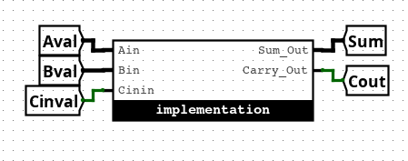
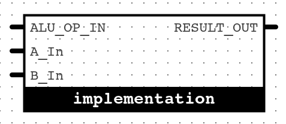
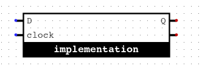

# Assignment 2: 4-bit Adder, ALU, and D Flip-Flop in Logisim

---

## Task 1: 4-bit Adder

**Inputs:**
- `A[3:0]`, `B[3:0]` (4-bit inputs)
- `Cin` (carry in)

**Outputs:**
- `Sum[3:0]` (4-bit sum)
- `Cout` (carry out)

**Requirements:**
- **Do not use arithmetic components** (no built-in adders).
- name your circuit `adder4.circ`
- Arrange your circuit to look like the diagram below when imported:

---

## Task 2: ALU (Arithmetic Logic Unit)

Your ALU should support the following operations based on the 4-bit `Opcode` input:

| Opcode | Operation      |
|--------|---------------|
| ?000   | Output A      |
| ?001   | Output B      |
| ?010   | A AND B       |
| ?011   | A OR B        |
| ?100   | A XOR B       |
| ?101   | NOT A         |
| ?110   | Negative A    |
| 0111   | A + B         |
| 1111   | A - B         |

(`?` can be 0 or 1; you may ignore it for implementation.)

**Requirements:**
- name your circuit `alu.circ`
- Arrange your ALU circuit to match the diagram below:

---

## Task 3: D Clocked Latch

**Flip-Flop and Latch:** \
In a FF, there is never a direct path from the input to the output. In a latch, there is a direct path from input to output when the clock is high. So the thing you are making here is a clocked latch, not a real flip-flop. Although logisim built-in D flip-flop can be a clocked latch (setting trigger to high/low level).

**Inputs:**
- `D` (data)
- `Clk` (clock)

**Outputs:**
- `Q`, `~Q` (inverted Q)

**Requirements:**
- **Do not use memory components** (no built-in flip-flops or latches).
- Arrange your circuit to look like the diagram below:
- name your circuit `dff.circ`

---

**Other things:**
- auto grader for alu and dff may still be buggy... under progress