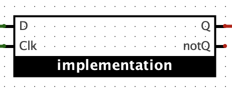
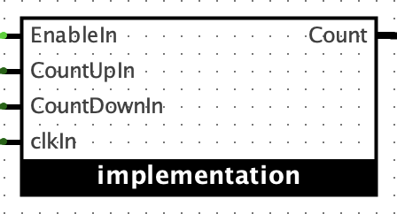
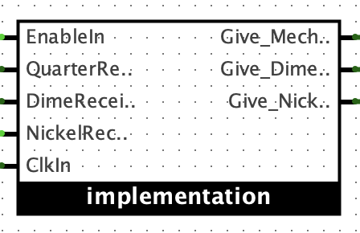

# Assignment 3: D Master-Slave Flip-Flop, Up and Down Counter, Vending machine

## D Master-Slave Flip-Flop

Build a D Master-Slave Flip-Flop that triggers on the rising edge of the clock signal.

**Inputs:**
- `D` (data input)
- `Clk` (clock input)

**Outputs:**
- `Q` (data output)
- `Qn` (inverted data output)

**Requirements:**
- name your circuit `MasterSlaveD.circ`
- do not use built-in D flip-flop.
- Arrange your circuit to look like the diagram below when imported:\

## 3-bit Up and Down Counter

**Inputs:**
- `Clk` (clock input)
- `CountUp` (1 bit)
- `CountDown` (1 bit)
- `Enable` (1 bit)

**Outputs:**
- `Count[2:0]` (3-bit count output)
  
**Hint:**
You are allowed to use registers to store the current state.

**Requirements:**
- name your circuit `UpDownCounter.circ`
- Count stay at `111` when trying to count up (Enable=1 & CountUpEn=1) from `111`
- Count stay at `000` when trying to count down (Enable=1 & CountDown=1) from `000`
- Built in counter is not allowed.
- Arrange your circuit to look like the diagram below when imported:\

**Autograder:**
Open [UpDownCountergrader.circ](UpDownCountergrader.circ) in Logisim and locate your solution circuit (remember to save). Run the grader via commandline and compare it with [UpDownoutput.txt](UpDownoutput.txt).

- to run the autograder: `java -jar logisim-evolution.jar UpDownCountergrader.circ -tty table`
- to save the output: `java -jar logisim-evolution.jar UpDownCountergrader.circ -tty table > myUpDownoutput.txt`
- to compare the output: `diff myUpDownoutput.txt UpDownoutput.txt`

## Vending Machine
Implement a vending machine that accepts nickels (5 cents), dimes (10 cents) and quarters (25 cents) and dispenses a product when 30 cents or more is inserted. The machine should also return change if more than 30 cents is inserted. The machine accepts one coin at a time.

**Inputs:**
- `Nickel` (1 bit) - high when a nickel is inserted
- `Dime` (1 bit) - high when a dime is inserted
- `Quarter` (1 bit) - high when a quarter is inserted
- `Clk` (1 bit) - clock signal
- `Enable` (1 bit) - allow state change when high

**Outputs:**
- `Give Merchandise` (1 bit) - high when the product is dispensed
- `Return Nickel` (1 bit) - high when a nickel is returned as change
- `Return Dime` (1 bit) - high when a dime is returned as change

**Hint:**
You are allowed to use registers to store the current state.

**Requirements:**
- name your circuit `Vending.circ`
- implement the vending machine as a mealy machine (outputs depend on current state and inputs) \
- Arrange your circuit to look like the diagram below when imported:\

**Autograder:**
Open [Vendinggrader.circ](Vendinggrader.circ) in Logisim and locate your solution circuit (remember to save). Run the grader via commandline and compare it with [Vendingoutput.txt](Vendingoutput.txt).